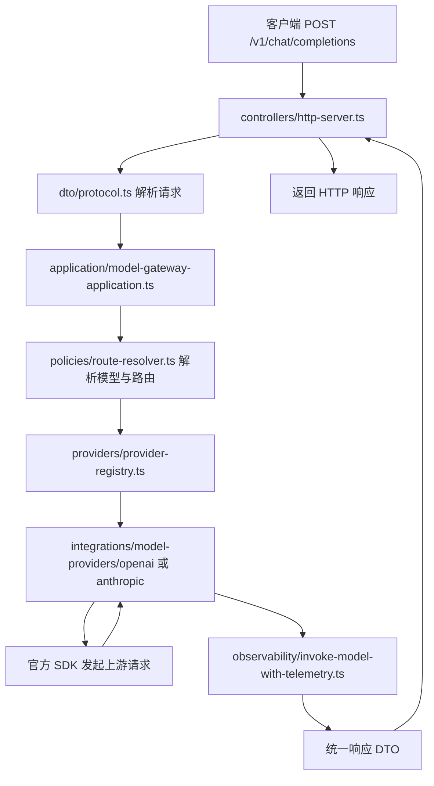

# model-gateway

统一承接模型注册、路由、调用、配额、降级、成本统计与审计埋点。

## 当前状态
当前已完成 P0 基础可用版：
- 已接入统一 telemetry SDK
- 已新增 `llm.call` 调用包装器
- 已能输出 `usage / cost / audit / trace / route` 元数据
- 已能生成 `trace_id`、`request_id`、`audit_id`
- 已接入真实 `openai`、`anthropic` provider adapter
- 已提供 `GET /v1/models` 与 `POST /v1/chat/completions`

## 整体架构

P0 当前涉及的主要模块如下：

```text
HTTP Request
  -> controllers/http-server.ts
  -> dto/protocol.ts
  -> application/model-gateway-application.ts
  -> policies/route-resolver.ts
  -> providers/provider-registry.ts
  -> integrations/model-providers/*/src/index.ts
  -> observability/invoke-model-with-telemetry.ts
  -> HTTP Response
```

按职责拆分后可以理解为 6 层：

1. 入口层
- `src/server.ts`
- `src/controllers/http-server.ts`

职责：
- 启动 HTTP 服务
- 路由分发 `GET /v1/models`、`POST /v1/chat/completions`
- 读取请求头中的 `traceparent`、`x-request-id`、`x-tenant-id`、`x-app-id`、`x-user-id`
- 统一写回成功响应或错误响应

2. 协议层
- `src/dto/protocol.ts`
- `src/domain/errors.ts`

职责：
- 解析并校验统一请求 DTO
- 定义统一成功响应结构
- 定义统一错误码和错误响应结构

3. 应用编排层
- `src/application/model-gateway-application.ts`

职责：
- 编排一次完整的 chat completion 调用
- 串联“请求解析 -> 路由解析 -> provider 调用 -> telemetry 包装 -> 统一响应”
- 将上游 provider 结果转成统一协议
- 将 provider 错误映射为网关错误码

4. 路由与领域层
- `src/policies/route-resolver.ts`
- `src/domain/types.ts`

职责：
- 基于 `requestedModel / aliases / routes / tenant / app / routeHints` 解析最终命中的模型
- 拼出 `ResolvedModelRoute`
- 保证模型与 provider 实例的一致性

5. Provider 抽象层
- `src/providers/types.ts`
- `src/providers/provider-registry.ts`

职责：
- 抽象统一的 provider adapter 接口
- 根据 provider 类型分发到具体 adapter
- 在调用前做 provider 是否已注册、凭据是否存在的基础校验

6. 供应商适配层
- `integrations/model-providers/openai/src/index.ts`
- `integrations/model-providers/anthropic/src/index.ts`

职责：
- 使用供应商官方 SDK 发起真实请求
- 屏蔽各家 SDK 的参数差异、返回结构差异和错误类型差异
- 转成网关统一的 provider 返回结构

## 整体调用链路

下面是 `POST /v1/chat/completions` 的完整调用链路：



### 详细时序

#### 第 1 步：HTTP 入口接收请求
文件：
- [server.ts](/spec-flow-ai/services/model-gateway/src/server.ts)
- [http-server.ts](/spec-flow-ai/services/model-gateway/src/controllers/http-server.ts)

入口层做的事：
- 判断请求路径和方法
- 对 `GET /v1/models` 直接走模型列表查询
- 对 `POST /v1/chat/completions` 读取 JSON body
- 解析 `traceparent`
- 生成或透传 `request_id`
- 从请求头补齐 `tenantId / appId / userId / sessionId / conversationId / workflowId / executionId`

#### 第 2 步：统一协议解析与校验
文件：
- [protocol.ts](/spec-flow-ai/services/model-gateway/src/dto/protocol.ts)
- [errors.ts](/spec-flow-ai/services/model-gateway/src/domain/errors.ts)

协议层做的事：
- 校验 `model`
- 校验 `messages`
- 校验 `system / tools / stream / metadata / routeHints / quotaSubject`
- 把非法请求转成 `ModelGatewayError`
- 若 `stream=true`，当前 P0 直接返回 `UNSUPPORTED_STREAM`

#### 第 3 步：进入 application 主链路
文件：
- [model-gateway-application.ts](/spec-flow-ai/services/model-gateway/src/application/model-gateway-application.ts)

这一层是当前 P0 的核心编排器，负责：
- 接收协议层产出的 `ChatCompletionRequest`
- 构造 telemetry 上下文
- 调用路由层解析目标模型
- 计算最终超时
- 组装审计用 prompt 文本
- 调用 provider registry
- 将结果包装成统一响应

#### 第 4 步：解析模型、provider 实例与路由
文件：
- [route-resolver.ts](/spec-flow-ai/services/model-gateway/src/policies/route-resolver.ts)
- [config.ts](/spec-flow-ai/services/model-gateway/src/config.ts)

这一段的输入来源是共享配置：
- `MODEL_GATEWAY_PROVIDERS_JSON`
- `MODEL_GATEWAY_MODELS_JSON`
- `MODEL_GATEWAY_ROUTES_JSON`

路由解析顺序：
1. 先按 `routes` 中的 `requestedModel` 命中规则
2. 再按 `tenantIds / appIds` 过滤
3. 同时命中多条时按 `priority` 选择
4. 如果没有命中规则，则回退到模型 ID 或 `aliases`
5. 如果请求显式指定 `routeHints.provider / providerInstance`，则最终命中结果必须满足提示

输出结果是 `ResolvedModelRoute`，其中包含：
- 请求的模型名 `requestedModel`
- 最终命中的注册模型 `resolvedModel`
- 最终命中的 provider 实例 `providerInstance`
- 命中的路由规则 ID `matchedRouteId`

#### 第 5 步：provider registry 分发到具体 adapter
文件：
- [provider-registry.ts](/spec-flow-ai/services/model-gateway/src/providers/provider-registry.ts)
- [types.ts](/spec-flow-ai/services/model-gateway/src/providers/types.ts)

这一层的职责是“统一入口、分发不同 provider”。

它会先做两类基础保护：
- 当前 provider 是否有已注册 adapter
- 当前 provider 实例是否具备可用凭据

然后把统一请求转交给具体 adapter：
- `openai` -> `integrations/model-providers/openai`
- `azure-openai` -> 当前先复用 `openai` adapter
- `anthropic` -> `integrations/model-providers/anthropic`

#### 第 6 步：供应商 adapter 调用官方 SDK
文件：
- [openai adapter](/spec-flow-ai/integrations/model-providers/openai/src/index.ts)
- [anthropic adapter](/spec-flow-ai/integrations/model-providers/anthropic/src/index.ts)

这一层专门处理供应商差异。

OpenAI adapter 当前做的事：
- 使用官方 `openai` SDK
- 创建 `OpenAI` client
- 设置 `apiKey / baseURL / timeout / defaultHeaders`
- 调用 `client.chat.completions.create(...).withResponse()`
- 抽取 `id / created / model / choices / usage / finishReason`
- 统一映射为 provider 返回结构

Anthropic adapter 当前做的事：
- 使用官方 `@anthropic-ai/sdk`
- 创建 `Anthropic` client
- 设置 `apiKey / baseURL / timeout / defaultHeaders`
- 调用 `client.messages.create(...).withResponse()`
- 抽取 `id / model / content / usage / stop_reason`
- 统一映射为 provider 返回结构

这里还会负责：
- 各家 tool 参数格式的适配
- `system` 消息的放置差异
- SDK 错误到统一错误码的初步映射

#### 第 7 步：observability 包装调用
文件：
- [invoke-model-with-telemetry.ts](/spec-flow-ai/services/model-gateway/src/observability/invoke-model-with-telemetry.ts)
- [types.ts](/spec-flow-ai/services/model-gateway/src/observability/types.ts)

这一层是当前 telemetry 主入口，负责：
- 建立 `llm.call` span
- 输出开始日志 `llm.call.started`
- 输出完成日志 `llm.call.completed`
- 构建成功审计记录或失败审计记录
- 统一产出 `usage / cost / audit / trace`

成功时输出：
- `usage`
- `cost`
- `audit.record`
- `trace.traceId / spanId / requestId`

失败时：
- 先生成失败审计记录
- 再抛出 `InstrumentedModelInvocationError`
- application 层再继续映射为外部错误响应

#### 第 8 步：application 统一组装返回
文件：
- [model-gateway-application.ts](/spec-flow-ai/services/model-gateway/src/application/model-gateway-application.ts)

最终返回的统一响应包括：
- `id / object / created / model`
- `choices`
- `usage`
- `cost`
- `audit`
- `trace`
- `route`

其中：
- `route` 用于告诉调用方“请求的模型”和“最终命中的模型”是否一致
- `audit` 当前最重要的是 `auditId`
- `trace` 当前最重要的是 `traceId / requestId`

#### 第 9 步：HTTP 层输出最终响应
文件：
- [http-server.ts](/spec-flow-ai/services/model-gateway/src/controllers/http-server.ts)

成功时：
- 返回 `200`
- 写回统一 JSON 响应
- 在 header 中写回 `x-request-id`
- 如存在 `traceId`，写回 `x-trace-id`

失败时：
- 将异常转换为统一错误结构
- 返回对应的 `statusCode`
- 响应体固定为：

```json
{
  "error": {
    "code": "MODEL_NOT_FOUND",
    "message": "未找到已注册模型: missing-model",
    "retryable": false,
    "requestId": "xxx",
    "traceId": "xxx",
    "auditId": "xxx"
  }
}
```

## 模块清单与职责

| 模块 | 文件 | 职责 |
| --- | --- | --- |
| 启动入口 | `src/server.ts` | 启动 HTTP 服务 |
| HTTP controller | `src/controllers/http-server.ts` | 路由分发、上下文透传、响应序列化 |
| DTO | `src/dto/protocol.ts` | 请求解析、协议校验、成功响应类型 |
| 领域错误 | `src/domain/errors.ts` | 统一错误码、错误对象和错误映射 |
| 领域类型 | `src/domain/types.ts` | 运行时配置和路由结果类型 |
| 应用服务 | `src/application/model-gateway-application.ts` | 主链路编排 |
| 路由策略 | `src/policies/route-resolver.ts` | 模型别名、app/tenant 路由命中 |
| provider 抽象 | `src/providers/types.ts` | adapter 接口定义 |
| provider registry | `src/providers/provider-registry.ts` | provider 分发与基础校验 |
| telemetry | `src/observability/*` | span、日志、审计、usage/cost 输出 |
| 配置解析 | `src/config.ts` | 从 shared-config 解析 runtime config |
| OpenAI adapter | `integrations/model-providers/openai/src/index.ts` | OpenAI SDK 适配 |
| Anthropic adapter | `integrations/model-providers/anthropic/src/index.ts` | Anthropic SDK 适配 |
| 共享配置 | `packages/shared-config/src/core/schema/model-gateway.ts` | provider/model/route schema |

## `GET /v1/models` 调用链路

这个接口相对简单，链路是：

```text
http-server.ts
  -> createModelGatewayApplication()
  -> application.listModels()
  -> routeResolver.listModels()
  -> 返回 active 模型列表
```

主要逻辑：
- 从运行时配置中读取所有已注册模型
- 过滤 `status=inactive`
- 补齐 `displayName / provider / providerInstance / aliases / capabilities / scenarioTags`

## 当前可用能力

### 1. 模型调用包装器
入口文件：
- [src/observability/index.ts](spec-flow-ai/services/model-gateway/src/observability/index.ts)

核心实现：
- [src/observability/invoke-model-with-telemetry.ts](spec-flow-ai/services/model-gateway/src/observability/invoke-model-with-telemetry.ts)

当前包装器支持：
- 建立 `llm.call` Span
- 输出开始日志与完成日志
- 构建成功/失败两类审计记录
- 返回 `usage`、`cost`、`audit`、`trace`
- 失败时抛出 `InstrumentedModelInvocationError`

### 2. 统一 HTTP 入口
- `GET /v1/models`：列出已注册可用模型
- `POST /v1/chat/completions`：统一 chat completion 非流式接口
- 入口文件：`src/controllers/http-server.ts`

### 3. Provider 与路由
- `integrations/model-providers/openai`：OpenAI adapter
- `integrations/model-providers/anthropic`：Anthropic adapter
- `src/providers/provider-registry.ts`：provider registry
- `src/policies/route-resolver.ts`：基础别名 / app / tenant 路由命中

### 4. 输入输出协议
协议定义：
- `src/dto/protocol.ts`
- `docs/specs/001-model-gateway/spec.md`

## 配置到运行时装配链路

配置装配从 [config.ts](/spec-flow-ai/services/model-gateway/src/config.ts) 开始，依赖 [shared-config schema](/spec-flow-ai/packages/shared-config/src/core/schema/model-gateway.ts)。

装配流程：
1. `getModelGatewayConfig()` 从共享配置包读取原始配置
2. `resolveModelGatewayRuntimeConfig()` 将配置转换为运行时对象
3. provider 实例在这里补齐：
   - `apiKey`
   - `authType`
   - `timeoutMs`
   - `headers`
4. 校验：
   - provider ID 不重复
   - model 绑定的 providerInstance 必须存在
   - route 指向的 targetModel 必须存在
5. 生成最终 `ModelGatewayRuntimeConfig`

这意味着当前的实际调用不是直接读环境变量，而是：

```text
config.yaml / config-<profile>.yaml / .env
  -> packages/shared-config
  -> services/model-gateway/src/config.ts
  -> runtime config
  -> application / route resolver / provider registry
```

## 观测与错误链路

当前一次成功调用会稳定输出以下信息：
- `traceId`
- `requestId`
- `auditId`
- `usage.inputTokens / outputTokens / totalTokens`
- `cost.estimatedUsd`
- `route.provider / providerInstance / requestedModel / resolvedModel`

当前一次失败调用会稳定输出以下信息：
- `error.code`
- `error.message`
- `requestId`
- `traceId`
- 如已进入 telemetry 包装阶段，还会生成失败 `auditId`

错误流的关键转换顺序是：

```text
provider SDK error
  -> adapter 映射为 PROVIDER_* 错误
  -> invokeModelWithTelemetry 记录失败审计
  -> application 转换为 ModelGatewayError
  -> controller 输出统一错误响应
```

## 配置示例

P0 通过共享配置包读取三段 JSON 注册表：

```yaml
APP_ENV: development
MODEL_GATEWAY_TIMEOUT_MS: 15000
MODEL_GATEWAY_PROVIDERS_JSON: >
  [{"id":"openai-default","provider":"openai","baseUrl":"https://api.openai.com/v1","apiKeyEnv":"OPENAI_API_KEY"}]
MODEL_GATEWAY_MODELS_JSON: >
  [{"id":"gpt-4.1-mini","providerModel":"gpt-4.1-mini","providerInstance":"openai-default","type":"chat","aliases":["support-chat"],"pricing":{"inputPerMillionUsd":0.4,"outputPerMillionUsd":1.6,"currency":"USD"}}]
MODEL_GATEWAY_ROUTES_JSON: >
  [{"id":"route-support","requestedModel":"support-assistant","targetModel":"gpt-4.1-mini","appIds":["support-app"],"priority":100}]
```

## 当前使用示例

### 示例：包装一次模型调用
```ts
import { invokeModelWithTelemetry } from "@enterprise-ai-hub/model-gateway-service";

const result = await invokeModelWithTelemetry({
  request: {
    context: {
      tenantId: "tenant-a",
      appId: "sales-assistant",
      userId: "user-1",
      serviceName: "model-gateway",
      environment: "dev",
      workflowId: "wf-sales",
      executionId: "exec-1",
    },
    provider: "openai",
    model: "gpt-4.1",
    prompt: {
      text: "总结本轮销售沟通重点",
      source: "template",
      templateId: "sales-summary",
      version: "v1",
    },
    settings: {
      temperature: 0.2,
      maxTokens: 800,
    },
  },
  invoke: async () => {
    return {
      providerResponse: {
        id: "resp_001",
      },
      responseText: "本轮沟通主要涉及预算、交付周期和采购流程。",
      finishReason: "stop",
      usage: {
        inputTokens: 128,
        outputTokens: 42,
        totalTokens: 170,
      },
      cost: {
        estimatedUsd: 0.0134,
      },
      httpStatusCode: 200,
    };
  },
});

console.log(result.trace.traceId);
console.log(result.audit.record.auditId);
console.log(result.usage.totalTokens);
```

返回结果中当前包含：
- `providerResponse`
- `usage`
- `cost`
- `audit`
- `trace`

### 失败场景示例
```ts
import {
  InstrumentedModelInvocationError,
  invokeModelWithTelemetry,
} from "@enterprise-ai-hub/model-gateway-service";

try {
  await invokeModelWithTelemetry({
    request,
    invoke: async () => {
      const error = new Error("upstream timeout");
      Object.assign(error, {
        code: "UPSTREAM_TIMEOUT",
      });
      throw error;
    },
  });
} catch (error) {
  if (error instanceof InstrumentedModelInvocationError) {
    console.log(error.traceId);
    console.log(error.requestId);
    console.log(error.auditId);
  }
}
```

### 示例：启动 HTTP 服务
```bash
pnpm --filter @enterprise-ai-hub/model-gateway-service dev
```

## 后续规划
- 补齐 SSE 流式输出
- 增加主备切换、超时控制、重试与熔断
- 接入真实 OTel Span 与 OTLP exporter
- 接入审计持久化与链路查询接口
- 将同样的埋点模式复用到 `retrieval-service`、`tool-gateway`、`workflow-service`

## 验证
相关测试：
- [src/observability/invoke-model-with-telemetry.test.ts](spec-flow-ai/services/model-gateway/src/observability/invoke-model-with-telemetry.test.ts)

本地命令：
```bash
pnpm --filter @enterprise-ai-hub/model-gateway-service typecheck
pnpm --filter @enterprise-ai-hub/model-gateway-service test
pnpm --filter @enterprise-ai-hub/model-gateway-service dev
```
